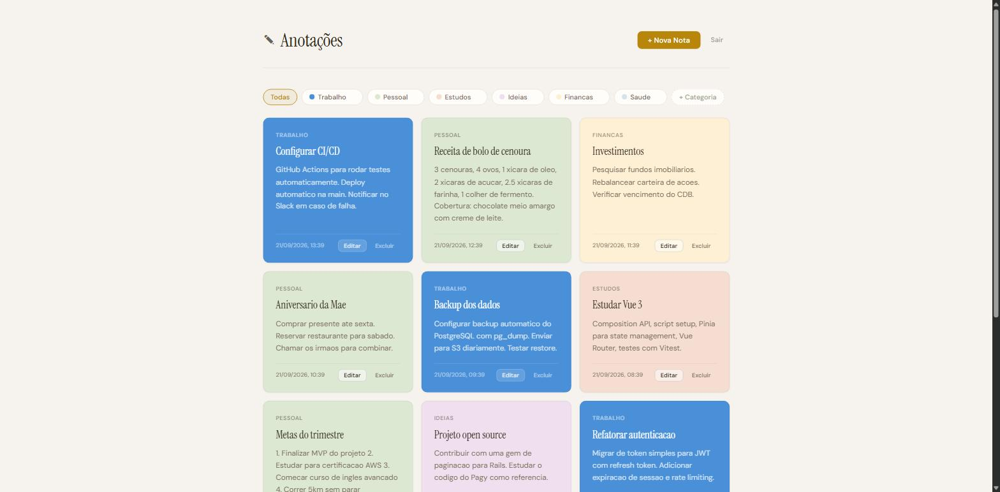
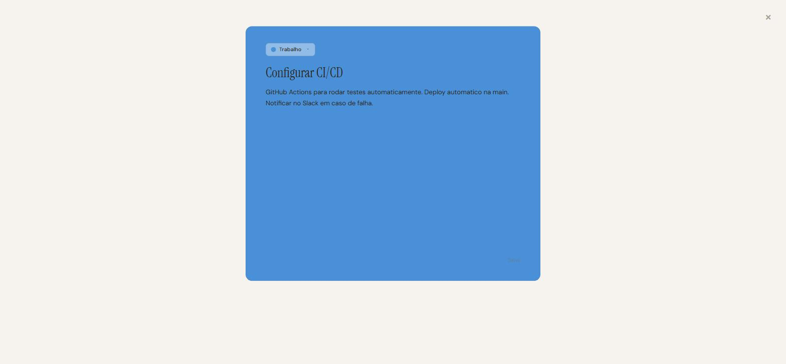

# Notes App

[](https://github.com/luislins/notes-app/actions/workflows/ci.yml)

A personal note-taking app with colour-coded categories. Rails 8 in API mode,
Vue 3 single-page frontend, PostgreSQL. Token authentication, autosaving
editor, 60 tests.

<!-- SCREENSHOTS
Add two before publishing:
  
  
-->

## Features

- Sign up and log in
- Full CRUD for notes
- Categories with custom colours
- Filter notes by category
- Fullscreen editor with autosave (500 ms debounce)
- Paginated listing
- SPA navigation with working browser back/forward
- Validation on both ends
- Cards adapt their text colour to dark category colours

## Stack

| | |
|---|---|
| Backend | Ruby 3.3.2, Rails 8.1 (API mode) |
| Frontend | Vue 3 (Composition API), Vue Router, Vite |
| Database | PostgreSQL |
| Auth | Bearer token (`has_secure_password` + bcrypt) |
| Tests | Minitest — 60 tests |
| Interface language | pt-BR |

## Technical decisions

**Rails in API mode.** A clean split between backend and frontend, talking
over HTTP/JSON. The Rails side renders nothing.

**Autosave instead of a save button.** Opening "New note" creates the record
immediately; edits persist on a 500 ms debounce. Notes left untitled are
deleted when the editor closes, so the immediate-create never leaves rubbish
behind.

**Vue Router in hash mode.** SPA navigation with real back/forward support.
Hash mode specifically because an API-only backend has no catch-all route to
fall back on, and adding one just to serve the SPA wasn't worth it.

**API layer split by domain.** `api.js` holds the base (token, headers);
`auth.js`, `notes.js` and `categories.js` each own their resource. No single
growing client object.

**Pagination without a gem.** `limit`/`offset` on ActiveRecord with pagination
metadata in the JSON payload. One less dependency for something this small.

**Colour contrast computed, not guessed.** The user picks any colour with the
native picker; cards compute luminance and flip their text between dark and
light so the label stays readable.

**Validation messages centralised in i18n.** All of them in
`config/locales/pt-BR.yml`, so the backend and the interface never disagree
about wording.

**Tests cover isolation, not just CRUD.** The 60 tests include the cases that
matter for a multi-user app: a user cannot read or modify another user's notes
and categories.

## Running it

Requires Ruby 3.3.2, Node 20+, PostgreSQL, Bundler and Foreman.

```bash
bundle install
npm install
bin/rails db:create db:migrate
bin/rails db:seed        # optional — demo@email.com / 12345678

bin/dev
```

- Rails API on http://localhost:5100
- Vue (Vite) on http://localhost:3036 ← open this one

### With Docker

```bash
docker compose up --build
docker compose exec web bin/rails db:create db:migrate
docker compose exec web bin/rails db:seed    # optional
```

## Tests

```bash
bin/rails test
```

## API

All endpoints except registration and login require
`Authorization: Bearer <token>`.

| Method | Endpoint | |
|---|---|---|
| POST | `/registration` | Sign up |
| POST | `/session` | Log in |
| DELETE | `/session` | Log out |
| GET | `/api/notes` | List notes (paginated) |
| GET | `/api/notes/:id` | Show a note |
| POST | `/api/notes` | Create a note |
| PATCH | `/api/notes/:id` | Update a note |
| DELETE | `/api/notes/:id` | Delete a note |
| GET | `/api/categories` | List categories |
| POST | `/api/categories` | Create a category |
| PATCH | `/api/categories/:id` | Update a category |
| DELETE | `/api/categories/:id` | Delete a category |

**Create a note**

```json
POST /api/notes
Authorization: Bearer <token>

{ "note": { "title": "A title", "content": "Optional body", "category_id": 1 } }
```

```json
201 Created

{
  "id": 1,
  "title": "A title",
  "content": "Optional body",
  "category_id": 1,
  "created_at": "2026-03-25T14:00:00.000Z",
  "updated_at": "2026-03-25T14:00:00.000Z",
  "category": { "id": 1, "name": "Trabalho", "color": "#4a90d9" }
}
```

**Paginated listing** — `GET /api/notes?page=1&per_page=12`

```json
{
  "notes": [],
  "meta": { "page": 1, "per_page": 12, "total": 20, "total_pages": 2 }
}
```

**Validation error**

```json
422 Unprocessable Entity

{ "errors": ["Título não pode ficar em branco"] }
```

## Layout

```
app/
├── controllers/
│   ├── api/
│   │   ├── notes_controller.rb        CRUD for notes, paginated
│   │   └── categories_controller.rb   CRUD for categories
│   ├── sessions_controller.rb         Log in / out
│   ├── registrations_controller.rb    Sign up
│   └── concerns/authentication.rb     Bearer token
├── models/
│   ├── user.rb
│   ├── note.rb
│   └── category.rb
└── frontend/
    ├── views/          LoginView · NotesView · NoteEditorView
    ├── components/     App · AuthForm · NoteForm · NoteList
    ├── services/       api · auth · notes · categories
    ├── router.js
    └── entrypoints/application.js
```

## License

MIT — see [LICENSE](LICENSE).
